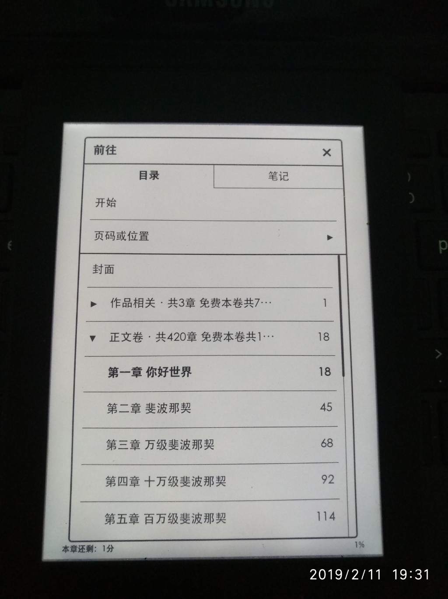
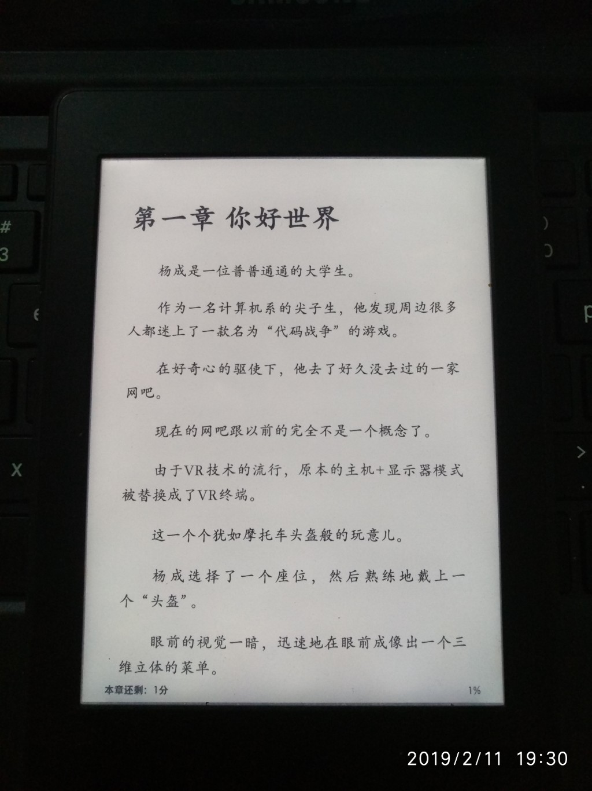

# 起点小说转mobi电子书

由起点中文网的免费小说生成epub电子书或者方便kindle阅读的mobi电子书。

## 介绍

最近QQ空间有朋友转发一部叫做《代码战争》的网文，号称没有计算机基础的人看不懂，着实让我产生了极大的兴趣，想要瞻仰一下大侠的文采,于是在起点中文网上找到了这篇神文，遗憾的是起点中文网不提供下载，而我想要在kindle上阅读，于是写了这段脚本，用以爬取小说并生成带目录的电子书。

## 食用方法

1. 获取起点中文网小说目录的网址, 如下图


2. 运行脚本，下载并生成epub电子书

```
python3 qidian.py
```

3. 使用kindlegen将epub电子书转换成mobi电子书

```
qidian2mobi$ bin/kindlegen book.epub
```

## kindle 截图

以下是在kindle Paperwhite 3上面的截图示例:
<table style="width:100%">
  <tr>
    <th>电子书目录</th> 
    <th>电子书正文</th>
  </tr>
  <tr>
    <td></td>
    <td></td>
  </tr>
</table>

## 写在最后 

1. 生成的电子书是有封面的，可是网站给的封面图太小了，kindle上面不会显示。
2. 由于网站可能改版，本脚本可能会失效，欢迎提出issue，我会及时改进。

附上一本转换好的mobi电子书《编程之战》供参考。


